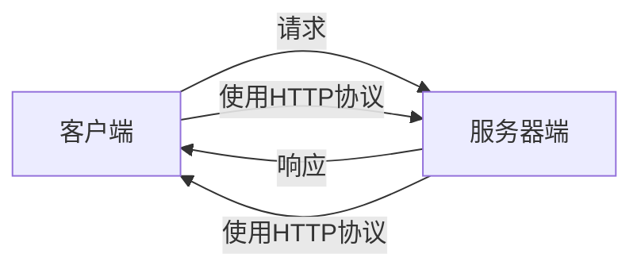
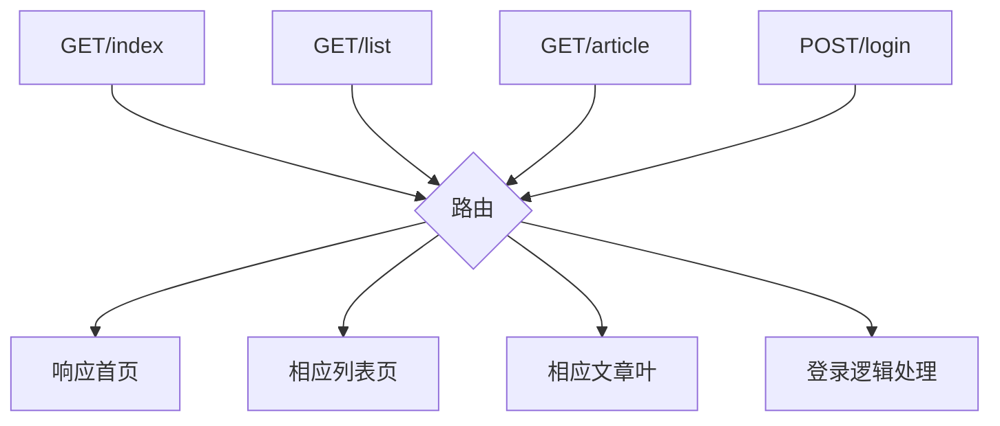

---
服务器端基本概念
---
### 1.URL

> 统一资源定位符，又称URL(Uniform Resource Locator),是专门为标识Internet网上资源位置而设的一种编址方式

##### URL组成

> 传输协议://服务器IP或域名:端口/资源所在位置标识
>
> http://www.baidu.cn/
>
> http: 超文本传输协议，提供了一种发布和接收HTML页面的方式

### 2.开发过程中客户端和服务端说明

> 在开发阶段，客户端和服务端使用同一台电脑，即开发人员电脑
>
> ```mermaid
> graph LR
> A{开发人员电脑}
> A-->|客户端| B[浏览器]
> A-->|服务端| C[Node]
> ```
>
> 本地域名：localhost
>
> 本地IP: 127.0.0.1

# 二、创建web服务器

```javascript
//http是用于创建网站服务器的模块
const http=require('http');
//创建web服务器，app就是网站服务器对象
const app=http.createServer();
//当客户端发送请求的时候
app.on('request',(req,res)=>{
    //响应
    res.end('<h1>hi,user</hi>');
});
//监听3000端口
app.listen(3000);
console.log('服务器已启动，监听3000端口，请访问localhost:3000');
```

* 访问网站：在命令行执行后，再在浏览器中输入`localhost:3000`即可访问创建的服务器

# 三、HTTP协议

### 1.概念

**超文本传输协议**（HyperText Transfer Protocol）规定了如何从网站服务器传输超文本到本地浏览器，它基于客户端服务器架构工作，是客户端和服务器端请求和应答的标准。



### 2.报文

在HTTP请求和响应的过程中传递的数据块叫做**报文**，报文包括要传递的数据和一些附加信息，并且要遵守规定好的格式。

* **通过浏览器查看报文**


### 3.请求报文

##### **请求方式(Request Method)**

* GET 请求数据
* POST 发送数据

1. **获取请求方式**

* 获取请求方式`req.Method`

```javascript
const http=require('http');

const app=http.createServer();
app.on('request',(req,res)=>{
    //通过req.Method获取请求方式
    console.log(req.method)
    res.end('<h2>hello,user</h2>');
});
app.listen(3000);
console.log('网站服务器启动');
```


* 通过表单获取请求，可指定表单提交的方式

```html
<form method="POST" action="http://localhost:3000">
        <!-- 
        method:指定当前表单提交的方式
        action:指定当前表单提交的地址 
        -->
        <input type="submit">
    </form>
```


##### 请求地址(Request URL)

* 获取请求地址`req.url`

```javascript
	//根据请求地址做出回应
	if(req.url=='/index'||req.url=='/'){
        res.end('welcom to html');
    }else if(req.url=='/list'){
        res.end('welcom to list');
    }else{
        res.end('not find! 404');
    } 
```

* 获取请求报文`req.headers`、获取具体报文信息`req.headers['具体信息']`

### 4.响应报文

##### 1.HTTP常见状态码

* 200 请求成功
* 404 请求的资源没有被找到
* 500 服务器端错误
* 400 客户端请求有语法错误

##### 2.内容类型

* text/html
* text/css
* application/javascript
* image/jpeg
* application/json
* text/plain

##### 3.设置状态码和内容类型

通过`res.writeHead(状态码,对象)`设置状态码和内容类型

```javascript
res.writeHead(200,{
	//content-type对应的就是内容类型
	//设置成按HTML解析内容和按utf8编码
	'content-type':'text/html;charset=utf8'
})
```

# 四、HTTP请求与响应处理

### 1.请求参数

客户端向服务器端发送请求时，有时需要携带一些客户信息，客户信息需要通过请求参数的形式发给服务器端。

### 2.GET请求参数

* 参数被放置在浏览器地址栏中，如：http://localhost:3000/?name=fawaikuangtu&age=18

* `req.url`可以获取GET参数`?name=fawaikuangtu&age=18`

* 解析GET参数，node.js有一个内置模块**url**可以解析GET参数,

  1. url.parse(req.url)`,返回一个没有解析的对象

 ```powershell
Url {
  protocol: null,
  slashes: null,
  auth: null,
  host: null,
  port: null,
  hostname: null,
  hash: null,
  search: '?name=fawaikuangtu&age=18',
  query: 'name=fawaikuangtu&age=18',
  pathname: '/',
  path: '/?name=fawaikuangtu&age=18',
  href: '/?name=fawaikuangtu&age=18'
}
 ```

2. `url.parse(req.url.true)`,返回一个被解析的对象

```powershell
Url {
  protocol: null,
  slashes: null,
  auth: null,
  host: null,
  port: null,
  hostname: null,
  hash: null,
  search: '?name=fawaikuangtu&age=18',
  query: [Object: null prototype] { name: 'fawaikuangtu', age: '18' },
  pathname: '/',
  path: '/?name=fawaikuangtu&age=18',
  href: '/?name=fawaikuangtu&age=18'
}
```

* 拿到参数装有解析好参数的对象`url.parse(req.url,true).query`

```javascript
let params=url.parse(req.url,true).query;
console.log(params.name,params.age);
```

### 3.POST请求参数

* 参数放置在请求报文中
* 参数是根据事件的方式接收的
  * data事件 当请求参数开始的时候触发
  * end事件  当请求参数结束的时候触发
  * **querystring**系统模块用于处理请求参数
  * `querystring.parse(字符串)`将请求字符串处理成对象

```javascript
const http=require('http');
const app=http.createServer();
//请求参数处理模块
const querystring=require('querystring');
app.on('request',(req,res)=>{
    //POST参数的传递不是连续的，所以声明一个变量放置参数
    let postParams='';
    req.on('data',params=>{
        postParams+=params;
    })
    req.on('end',()=>{
        console.log(querystring.parse(postParams));
    })
    res.end('ok!!!!!');
})
app.listen(3000);
console.log('端口3000已开启');
```

### 4、路由

路由是指客户端请求地址与服务器端代码之间的对应关系，简单来说，就是请求什么响应什么。



```javascript
const http=require('http');
const url=require('url');

const app=http.createServer();
app.on('request',(req,res)=>{
    const method=req.method.toLowerCase();
    const pathname=url.parse(req.url).pathname;
    res.writeHead(200,{
        'content-type':'text/html;charset=utf8'
    })
    if(method=='get'){
        if(pathname=='/'||pathname=='/index'){
            res.end('欢迎访问首页!!!');
        }else if(pathname=='/list'){
            res.end('欢迎来到列表页!!!');
        }else{
            res.end('你所访问的页面不存在！！！');
        }
    }
    else if(method=='post'){

    }

})
app.listen(3000);
console.log('服务器已启动!!!!!!!!!');
```

### 5、静态资源

服务器端不需要处理，可以直接响应给客户端的资源就是静态资源，例如CSS、javaScript、image文件等

* 第三方模块:mime下的getType方法可以根据请求路径返回对应请求的类型：`mime.getType(pathname)`

```javascript
const http=require('http');
const url=require('url');
const path=require('path');
const fs=require('fs');
const mime=require('mime');

const app=http.createServer();
app.on('request',(req,res)=>{
    let pathname=url.parse(req.url).pathname;
    pathname=pathname=='/'?'/index.html':pathname;
    let realPath=path.join(__dirname,'/public',pathname);
    var type=mime.getType(realPath);
    fs.readFile(realPath,(error,result)=>{
        if(error!=null){
            res.writeHead(404,{
                'content-type':'text/html;charset=utf8'
            })
            res.end('路径不存在！！');
            return;
        }
        //指定返回资源的类型
        res.writeHead(200,{
            'content-type':type
        })
        res.end(result);
    })
})
app.listen(3000);
console.log('服务器已启动!!!!!!!!!');
```


### 6、动态资源

相同的请求地址，不同的响应资源，这种资源就是动态资源

# 五、Node.js异步编程

### 5.1 同步API，异步API

**同步API**：只有当当前API执行完成后，才能继续执行下一个API

**异步API**：当前API的执行不会阻塞后面代码的执行

**区别：**

* 同步API可以从返回值中拿到API执行的结果，但异步API不可以
* 同步API是从上到下一次执行的，前面代码会阻塞后面代码;而异步API不会等待API执行完再执行其他代码

### 5.2 回调函数

自己定义函数让别人去调用。可用于取得异步API的结果

```javascript
function getMsg(callback){
	setTimeout(function(){
		callback({
		msg:'hello world'
		})
	},2000);
}
//callback对应下面的匿名函数，callback({msg:'hello world'})对应function(data)
getMsg(function(data){
	console.log(data);
})
```

### 5.3 Node.js中的回调函数

```javascript
fs.readFile('./file',(err,result)=>);
```

```javascript
const server=http.createServer();
server.on('quest',(req,res)=>{});
```

### 5.4 回调地狱：回调函数嵌套

解决方法：**Promise**(实际上是一个构造函数)

Promise出现的目的是为了解决回调地狱的问题。

```javascript
let promise=new Promise((resolve,reject)=>{
	setTimeout(()=>{
		if(true){
			resolve({name:'美琴'});
		}else{
			reject('失败了');
		}
	},2000);
});
promise.then(result=>console.log(result);//{name:'美琴'})
		.catch(error=>console.log(error);//失败了)
```

```javascript
const fs=require('fs');

 let promise=new Promise((resolve,reject)=>{
     fs.readFile('./12.callback.js','utf8',(err,result)=>{
         if(err!=null){
             reject(err);
         }else{
             resolve(result);
         }
     })
 })
 promise.then(result=>{
     console.log(result);
 })
 .catch(err=>{
     console.log(err);
 })
```

```javascript
//解决回调地狱
function f1(){
    return  promise=new Promise((resolve,reject)=>{
     fs.readFile('./12.callback.js','utf8',(err,result)=>{
         if(err!=null){
             reject(err);
         }else{
             resolve(result);
         }
     })
}
function f2(){
    return  promise=new Promise((resolve,reject)=>{
     fs.readFile('./12.callback.js','utf8',(err,result)=>{
         if(err!=null){
             reject(err);
         }else{
             resolve(result);
         }
     })
}
function f3(){
    return  promise=new Promise((resolve,reject)=>{
     fs.readFile('./12.callback.js','utf8',(err,result)=>{
         if(err!=null){
             reject(err);
         }else{
             resolve(result);
         }
     })
}
fi().then(result=>{ console.log(result);
     return f2();
 })
 .catch(err=>{console.log(err);
 })     
 .then(result=>{ console.log(result);
     return f3();
 })
 .catch(err=>{console.log(err);
 })
 .then(result=>{console.log(result);
 })
 .catch(err=>{console.log(err);
 }) 
```

### 5.5 异步函数

异步函数是异步编程语法的**终极解决方案**，它可以让我们将异步函数写成同步函数的形式，让代码不再有回调函数嵌套，使代码简洁清晰。

**语法**

```javascript
const fn=async ()=>{};
```

```javascript
async function fn(){};
```

* 在普通函数前面加上**async**关键字，普通函数就变成了异步函数
* 异步函数默认的返回值是**Promise对象**
* 用**then**接收**return**返回的结果，用**throw**抛出错误结果给**catch**,一旦**throw**返回了结果后面代码就不再执行了
* 异步函数中还存在一个特有的关键字**await**
* **await**后面只能跟**promise**对象
* `await promise`可以暂停异步函数的执行，等待**promise**对象返回结果后再向下执行

```javascript
async function fn(){
	throw'发生了错误';
	return'运行正常';
}
fn().then(function(data){
	console.log(data);
}).catch(function(err){
	console.log(err);
})
```

```javascript
//解决回调地狱
asyns function f1(){
    return 'p1';
}
async function f2(){
    return 'p2';
}
async function f3(){
    return 'p3';
}
async function run(){
	let p1=await f1();
	let p2=await f2();
	let p2=awiat f3();
	console.log(p1);
	console.log(p2);
	console.log(p3);
}

```

* 异步函数起初在Node.js中无法使用，后来出现了**util**模块下的**promisify**方法使得Node.js中的异步函数能返回**promise**对象
* `const promisify=require('util').promisify`

```javascript
//依次读取文件
const fs=require('fs');
const promisify=require('util').promisify;
const readFile=promisify(fs.readFile);

async function run(){
    let f1=await readFile('./12.callback.js','utf8')
    let f2=await readFile('./2.module-a.js','utf8')
    let f3=await readFile('./3.module.exports.js','utf8')
    console.log(f1)
    console.log(f2)
    console.log(f3)
}
run();
```

# 六、Node.js全局对象global

在浏览器中全局对象是**window**,在Node.js中全局对象是**global**


### 案例

```javascript
//用于创建网站服务器的模块
const http=require('http');
const url=require('url');
//app对象就是网站服务器对象
const app=http.createServer();
app.on('request',(req,res)=>{
    res.writeHead(200,{
        'content-type':'text/html'
    })
    //获取GET参数并解析
    //console.log(url.parse(req.url,true));
    let {query,pathname}=url.parse(req.url,true);//使用解构
    console.log(query.name,query.age);
    let {query,pathname}=url.parse(req.url,true);
    console.log(query.name,query.age);
    if(pathname=='/index'||pathname=='/'){
        res.end('welcom to index');
    }else if(pathname='/list'){
        res.end('welcom to list');
    }else{
        res.end('not fond!404');
    }
    //获取请求报文
    //console.log(req.headers);
    //获取请求方式
    //console.log(req.method)
    res.end('<h2>hello,user</h2>');
});
//监听端口
app.listen(3000);
console.log('网站服务器启动');


```


