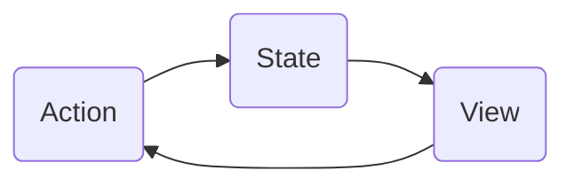
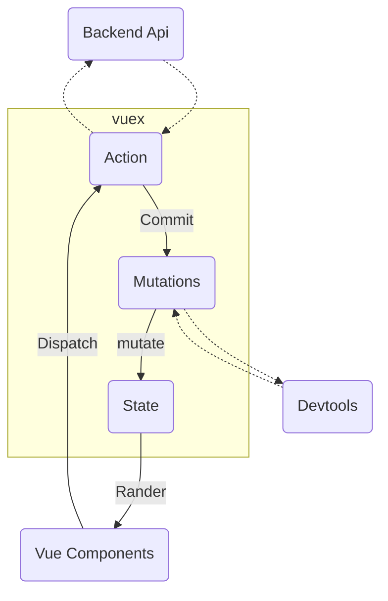

---
vuex
---
* Vuex是一个专门为Vue.js应用程序开发的**状态管理模式**
  * 它采用==集中式存储管理==应用的所有组件的状态，并以相应的规则保证状态以一种可预测的方式发生变化
  * Vuex也集成到Vue的官方调试工具==devtools extension==，提供了诸如零配置time-travel调试、状态快照导入导出等高级调试功能

### 1.vuex使用

* ==安装==：`npm install --save vuex`

* 引入

  * 可以直接在main.js中引入，但一般不这样写，因为这样会使代码变得混乱
  * 一般在src下面创建一个**store文件夹**，在里面的index.js中引入

  ```javascript
  import Vue from 'vue'
  import Vuex from 'vuex'
  
  //安装
  Vue.use(Vuex)
  
  //创建对象
  const store = new Vuex.store({
  	state:{
  
      },
      mutations:{
  
      },
      actions:{
          
      },
    	getters:{
        
      },
    	modules:{
        
      }
  })
  //导出
  export default store
  ```

* store对象中的属性：

  * state：保存状态（数据之类的，如counter），在其他界面可通过`$store.state.counter`来获取数据

  * mutations：对同步数据进行操作

  * actions：主要用于进行异步操作

  * getters：类似与组件里面的计算属性

  * modules：专门划分模块

### 2.单页面的状态管理

* State:状态(例如data中的属性)
* View:视图层，可以针对State的变化，显示不同的信息
* Action:这里的Action是指用户的各种操作，如点击、输入等




### 3.多页面状态管理

* 不能通过State直接改变状态，必须经过Mutations来改变State的状态，这样Devtools（针对Vue的一个浏览器插件）才能监听并记录到状态的改变，但Devtools只能记录到Mutations中的同步操作，如果是异步操作就无法被记录了，所以才有Action，可在Action中将异步操作处理完，再在Mutations中进行记录。在进行Backend Api(后端Api)请求时，一般进行的就是异步操作。




### 4.state

store对象中的属性：

* state：保存状态（数据之类的，如counter），在其他界面可通过`$store.state.counter`来获取数据
  * 单一状态树(Single Source Of Truth)：
    * 如果我们的状态信息被保存在多个store中，那么之后的管理和维护就会变得十分困难
    * 所以vuex使用了单一状态树来管理所有层级的全部状态（所有状态放在一个store里）
    * 单一状态树能让我们能够以最直接的方式找到某个状态片段，而且之后的管理与维护也会变得非常方便

### 5.getters

Vuex 允许我们在 store 中定义“getter”（可以认为是 store 的计算属性）。就像计算属性一样，getter 的返回值会根据它的依赖被缓存起来，且只有当它的依赖值发生了改变才会被重新计算。

Getter 接受 state 作为其第一个参数，接收getter作为第二个参数

 * getters：类似与组件里面的计算属性

    * ```javascript
      getters:{
              square(state){
                  return state.count * state.count
              }
          }
      ```

    * 直接通过`<h2>{{$store.getters.square}}</h2>`获取getters内的内容

    * 在getters中的函数还可以获取getters内其他函数的数据

      * ```javascript
        getters:{
                square(state){
                    return state.count * state.count
                },
                getSquare(state,getters){
                  return getters.square
                }
            }
        ```

    * 根据传回来的数据动态返回`<h2>{{$store.getters.getAge(12)}}</h2>`

    * ```javascript
      getters:{
      				//要动态返回数据，就需要返回一个函数，用返回的函数来接收传过来的参数
              getAge(state){
                  return function(age){
                      return state.students.filter(s => s.age > age)
                  }
              }
          },
      ```
### 6.mutations

* vuex的store更新状态的唯一方式是：**提交Mutation**

* Mutation主要包括两个部分：

  * 字符串的事件类型(type)
  * 一个回调函数(handler)，该回调函数的第一个参数是state

* Mutation的参数：

  * 第一个参数是state

  * 第二个参数(**payload:载荷**)是提交过来的数据

    * 提交

    ```javascript
    addCount(data){
          this.$store.commit('incrementCount',data)
        }
    ```

    * 接收

    ```javascript
     incrementCount(state,data){
           state.count += data
      }
    ```

    

* mutations中的函数会默认传入一个state

* ```javascript
  mutations:{
          increment(state){
              state.count++
          }
      }
  ```

* 在其他地方提交`$store.commit()`即可使用mutations内的函数了

* ```javascript
  methods:{
      addition(){
        this.$store.commit('increment')
      }
    }
  ```

##### Mutation的提交风格

* 普通风格

```javascript
//提交
addCount(count){
  this.$store.commit('increment',count)
}
//接收
mutations(state,count){
  state.counter += count
}
```

* vue还提供了另外一种风格，它是一个包含type属性的对象

```javascript
//提交
addCount(count){
	this.$store.commit({
    type:'increment',
    count:count
  })
}
//接收
mutations(state,payload){
  state.counter += payload.count
}
```

##### Mutation响应规则

* Vuex的store中的state是响应式的，当state中的数据发生改变时，Vue组件就会自动更新
* 这就要求我们必须遵循一些Vuex对应的规则：
  * 提前在store中初始化好所需要的数据
  * 当给state中的对象添加新属性时，使用以下方法
    * 方式一：使用`Vue.set(obj,'key',value)`
      * 还有一个可以删除响应式对象的属性：`Vue.delete(obj,'key')`
    * 方式二：用新对象给旧对象重新赋值

### 7.actions

* Action类似于Mutation，但是用来代替Mutation进行异步操作的
* 在Vue中对Action提交数据用`dispatch`，使用方法类似`commit`
* `actions`处理异步操作后要将数据传给`mutations`进行处理

```javascript
changeAge(){
  $this.store.dispatch('Age',data)
}
```

```javascript
actions:{
        Age(context,data){
            setInterval(()=>{
                context.commit('updataInfo',data)
            },3000)
        }
    },
 mutations:{
        updataInfo(state,data){
            state.teacher.age += data
        }
    },
```

### 8.modules

* Vue使用单一状态树，那么也就意味着很多状态都会交给Vuex来处理
* 当应用变得十分复杂的时候，store也会变得十分地臃肿
* 为了解决这个问题，Vuex允许我们将store分割成模块，每个模块都拥有自己的state、getters、mutations、actions、modules

### 9.vuex-store文件夹目录结构

> —store
>
> >—index.js                       //我们组装并导出store的地方
> >
> >—actions.js                    //根级别的actions
> >
> >—mutations.js               //根级别的mutations
> >
> >—modules                      
> >
> >>—cart.js                       //购物车模块
> >>
> >>—products.js              //产品模块