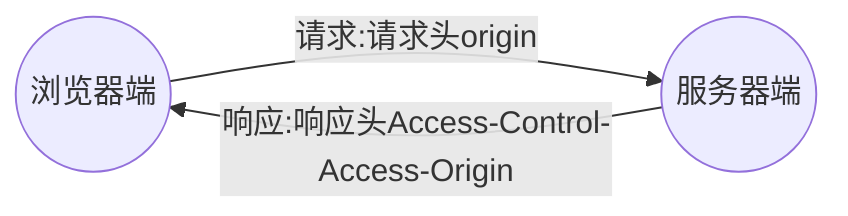

---
同源政策
---
### 1.Ajax请求限制

Ajax只能向自己的服务器发送请求，比如有一个A网站和一个B网站，A网站的HTML文件只能向A网站的服务器发送Ajax请求，同理，B网站也是这样的

### 2.什么是同源

如果两个页面拥有相同的协议、域名和端口，那么这两个页面就属于同一个源，但其中只要有一个不一样，就不是同源。

```
http://www.example.com/dir/page.html

http://www.example.com/dir2/index.html 同源

http://example.com/dir/index.html 不同源(域名不同)

http://www.example.com:81/dir/index.html 不同源(端口不同)

https://www.example.com/dir/index.html 不同源(协议不同)
```

### 3.同源政策的目的

同源政策是为了保护用户信息的安全，防止恶意的网站窃取数据。最初的同源政策是指A网站在客户端设置的Cookie，B网站是不能访问的。

随着互联网的发展，同源政策也越来越严格，在不同源的情况下，其中有一项规定就是无法向非同源地址发送Ajax请求，否则浏览器会报错。

### 4.使用JSONP解决同源限制问题

jsonp是json with padding的缩写，它不属于Ajax请求，但它可以模拟Ajax请求。

1. 将不同源的服务器端请求地址写在script标签的src属性中

```javascript
<script src='www.example.com'></script>
```

2. 服务器端响应数据必须是一个函数的调用，真正要发送给客户端的数据需要作为函数调用的参数。

```javascript
const data = fn({name:'qin',age:'18'});
res.send(data);
```

3. 在客户端全局作用域下定义函数fn,fn要在script标签前

```javascript
function fn(data){}
```

4. 在fn函数内部对服务器端返回的数据进行处理

```javascript
function fn(data)(console.log(data);)
```

### 5.JSONP代码优化

1. 客户端需要将函数名称传递到服务前端
2. 将Script请求的发送变为动态请求
3. 封装JSONP函数，方便请求发送

**客户端**

```javascript
var btn = document.querySelector('#btn');
        btn.onclick = function(){
            json({
                url:'http://localhost:3001/better',
                data:{
                    name:'qin',
                    age:18
                },
                success:function(){}
            });

        }
        function jsonp(options){
            var script = document.createElement('script');
            //因为jsonp应用于get请求，所以对数据进行一下处理
            var params = '';
            for (var attr in options.data){
                params +='&' + attr + '=' + 'options.data[attr]';
            }
            //生成随机函数名字 myJson+随机数
            var fnName = 'myJsonp' + Math.random().toString().replace('.','');
            //接收的函数包含在对象内部之后，不在是一个全局函数了，所以要将其变为全局函数
            //将其挂载在window中
            //window.fn = options.success;
            //挂载随机函数名
            window[fnName] = options.success;
            script.src = options.url + '?callback=' + fnName + params;
            document.body.appendChild(script);
            script.onload = function(){
                document.body.removeChild(script);
            }
        }
    </script>
```

**服务器端**

```javascript
app.get('/better',(req,res)=>{
    //接收客户端传递过来的函数名称;
    // const fnName = req.query.callback;
    // const data = JSON.stringify({name:"qin"});
    // const data = fnName + '('+ data +')';
    // res.send(data);

    res.jsonp({name:'qin',age:18});
})
```

# 2.腾讯天气案例

* 请求地址
  * https://wis.qq.com/weather/common
* 请求方式
  * get 支持jsonp
* 参数

|    参数名    | 必选 |  类型  |                     说明                      |
| :----------: | :--: | :----: | :-------------------------------------------: |
|    source    |  是  | string |                    pc、xw                     |
| weather_type |  是  | string | forecast_1h未来48小时</br>forecast_24h未来7天 |
|   province   |  是  | string |                     省份                      |
|     city     |  是  | string |                     城市                      |

* 返回值

```javascript
{
"data":{
  "alarm":{},
  "forecast_1h":{
  "0":{
   "degree":"25",//温度
  "update_time":"20200603210000",//时间
   "weather":"阴",//天气
   "weather_code":"02",//天气码
   "weather_short":"阴",//天气简要名称
   "wind_direction":"西南风",//风向
   "wind_power":"4"//风力
      }
  }
}
  "message":"ok",
    "sattus":200
}
```

###  6.CORS跨域资源共享

CORS：全称Cross-origin resource sharing,即跨域资源共享，它允许浏览器向跨域服务器发送Ajax请求，克服了Ajax只能同源使用的限制。



*请求*
```javascript
origin:http//localhost:3000
```

*响应*

```javascript
Access-Control-Allow-Origin:'http//localhost:3000'
Access-Control-Allow-Origin:'*'
```

**在服务器端设置允许访问的客户端**

```javascript
app.get('/cross',(req,res)=>{
  //1.允许那些客户端访问
  res.header('Access-Control-Allow-Origin','*')//允许所有客户端访问
  //2.允许客户端以哪种方式访问
  res.header('Access-Control-Allow-Methods','get,post')//允许以get和post方式访问
})
```

*优化*

```javascript
//拦截所有请求,给他们都加上允许访问的请求头
app.use((req,res,next)=>{
   //1.允许那些客户端访问
  res.header('Access-Control-Allow-Origin','*')//允许所有客户端访问
  //2.允许客户端以哪种方式访问
  res.header('Access-Control-Allow-Methods','get,post')//允许以get和post方式访问
  next();
})
```

### 7.服务器端解决同源问题

同源政策是浏览器给予Ajax技术的限制，服务器端是不存在同源政策限制的。

使用`request`包让服务器端具有向其他服务器申请访问的能力。

### 8.withCredentials属性

在使用Ajax技术发送跨域请求时，默认情况下不会在请求中携带Cookis信息。

withCredentials:指定在涉及到跨域请求时，是否携带cookie信息，默认为false.

Access-Control-Allow-Credentials:true;允许客户端请求时携带cookie.